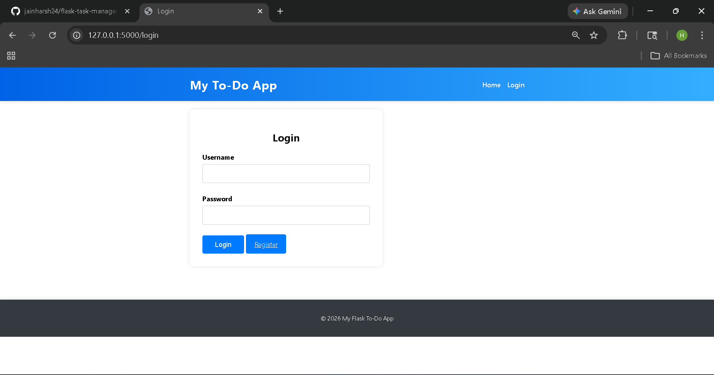
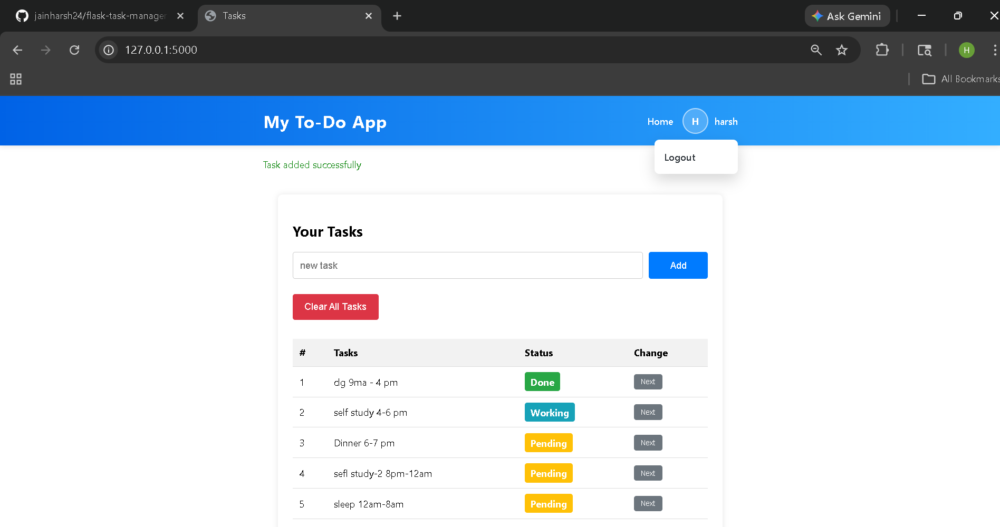

# Flask Task Manager

## Webpage Name
`My To-Do App`

## Summary
Flask Task Manager is a simple task management web application built with Flask and SQLite.  
It allows users to register, log in, and manage their own personal tasks in a clean dashboard.  
Each user can create tasks, update their status, and clear their own task list.  
The project also includes session-based authentication and a profile menu in the header.

## Features
- User registration and login system
- Session-based authentication
- User-specific task dashboard
- Add new tasks
- Update task status from `Pending` to `Working` to `Done`
- Clear all tasks for the logged-in user
- Profile icon with username and logout option
- Auto logout after server restart

## Screenshots

### Login Page


### Dashboard



## Steps to Download and Run
1. Clone the repository:

```bash
git clone <your-repository-url>
```

2. Move into the project folder:

```bash
cd flask-task-manager-main
```

3. Create and activate a virtual environment:

```bash
python -m venv venv
```

Windows:

```bash
venv\Scripts\activate
```

4. Install dependencies:

```bash
pip install -r requirements.txt
```

5. Run the project:

```bash
python run.py
```

6. Open the app in your browser:

```bash
http://127.0.0.1:5000
```

## Tech Stack
- Python
- Flask
- Flask-SQLAlchemy
- SQLite
- HTML
- CSS
